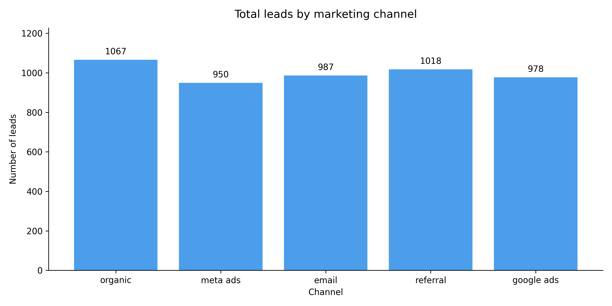
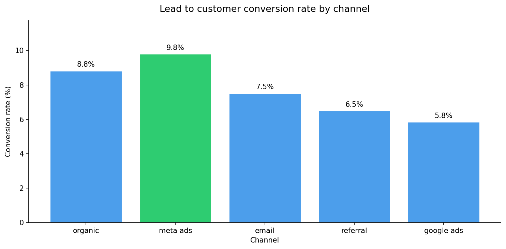
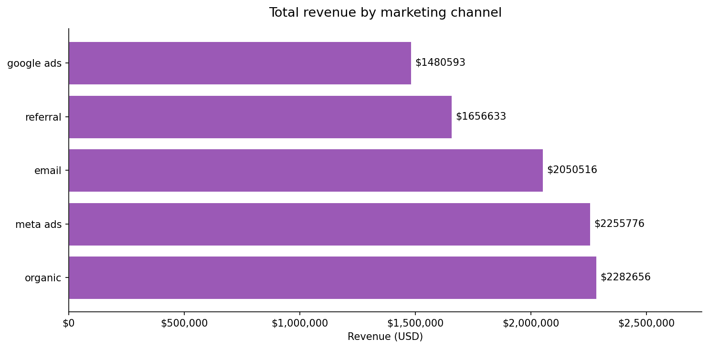
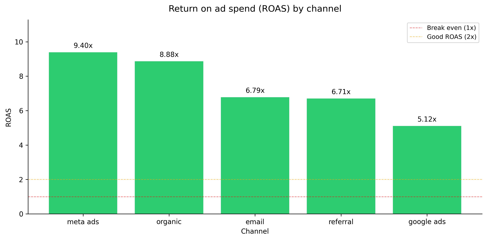

# Marketing Funnel ETL Pipeline

An end-to-end data engineering pipeline that ingests, transforms,
and analyses B2B marketing funnel data across 5 channels and 5 funnel
stages — built with Python, dbt Core, and SQLite.

---

## Problem statement

Marketing teams track leads across multiple channels — Google Ads,
Meta Ads, Email, Organic, and Referral. Data lives in separate CSV
exports with no automated reporting. This pipeline:

- Ingests raw lead and campaign spend data into a local data warehouse
- Applies cleaning and standardisation using dbt staging models
- Calculates funnel conversion rates, revenue attribution, and ROAS
- Produces business-ready tables and charts for stakeholder reporting

---

## Architecture

```
Raw CSV data
    ↓
Python ingestion (Pandas + SQLite)
    ↓
dbt staging models  →  stg_leads, stg_campaign_spend
    ↓
dbt mart models     →  mart_funnel_metrics, mart_channel_roi
    ↓
Analysis notebook   →  4 business charts saved to docs/
```

---

## Tech stack

| Tool | Purpose | Cost |
|------|---------|------|
| Python + Pandas | Data generation and ingestion | Free |
| Faker | Realistic test data generation | Free |
| SQLite | Local data warehouse | Free |
| dbt Core | Data transformation and testing | Free |
| Matplotlib | Data visualisation | Free |
| GitHub Actions | CI/CD — runs dbt tests on push | Free |

---

## Project structure

```
marketing-funnel-etl/
├── data/
│   ├── raw/                    # Raw CSV files (generated)
│   └── processed/              # Cleaned outputs
├── ingestion/
│   ├── generate_data.py        # Generates 5,000 leads with Faker
│   └── load_to_sqlite.py       # Loads CSVs into SQLite
├── dbt_project/
│   ├── models/
│   │   ├── staging/            # stg_leads, stg_campaign_spend
│   │   └── marts/              # mart_funnel_metrics, mart_channel_roi
│   └── profiles.yml            # dbt connection config
├── analysis/
│   └── funnel_analysis.ipynb   # Analysis notebook with charts
├── docs/                       # Chart images for this README
└── requirements.txt
```

---

## Key metrics produced

| Metric | Description |
|--------|-------------|
| Lead to customer % | Conversion rate from lead to paying customer |
| Avg deal size | Average revenue per converted customer |
| Cost per lead | Ad spend divided by leads generated |
| Cost per customer | Ad spend divided by customers acquired |
| ROAS | Return on ad spend — revenue / spend |

---

## Charts

### Leads by channel


### Conversion rate by channel


### Revenue by channel


### ROAS by channel


---

## How to run this project

### 1. Clone the repo
```bash
git clone https://github.com/YOUR_USERNAME/marketing-funnel-etl.git
cd marketing-funnel-etl
```

### 2. Create and activate virtual environment
```bash
python -m venv venv
source venv/bin/activate      # Windows: venv\Scripts\activate
pip install -r requirements.txt
```

### 3. Generate data and load to SQLite
```bash
python ingestion/generate_data.py
python ingestion/load_to_sqlite.py
```

### 4. Run dbt transformations
```bash
cd dbt_project
dbt run --profiles-dir .
dbt test --profiles-dir .
```

### 5. Open the analysis notebook
Open `analysis/funnel_analysis.ipynb` in VS Code and run all cells.

---

## Data quality tests

This project includes 13 automated dbt tests covering:
- Unique and not-null checks on all primary keys
- Row count validation after ingestion
- Referential integrity between staging and mart models

Run all tests with:
```bash
dbt test --profiles-dir .
```

---

## Business impact

This pipeline replaces a manual weekly Excel process. In a production
setting it would:
- Save 4–6 hours of manual reporting per week
- Give the marketing team real-time funnel visibility
- Enable data-driven channel budget allocation based on ROAS

---

## Author

Built by Ganga Raj as part of a Data Engineering portfolio.
Connect on LinkedIn: https://www.linkedin.com/in/gangaraj1211/